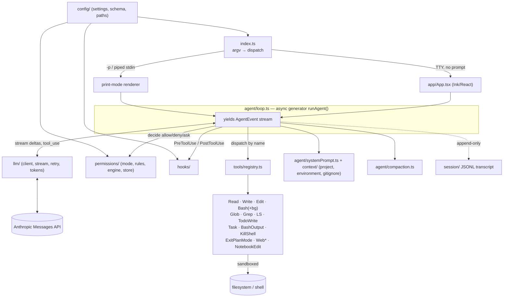

# Architecture — Agent Code

A production-grade, Claude Code–class terminal coding agent built from scratch in TypeScript
(ESM, Node ≥18). This document describes the system design. For the phased build order and
verification strategy, see [`ROADMAP.md`](ROADMAP.md).

## Goals & decisions

- **Runtime:** TypeScript (ESM), Node ≥18.
- **TUI:** Ink (React-in-terminal) + React + Yoga layout + chalk. Streaming output, interactive
  permission prompts, slash-command menu.
- **Provider:** Anthropic-only via `@anthropic-ai/sdk` Messages API — streaming, tool use,
  prompt caching, extended thinking.
- **Auth:** `ANTHROPIC_API_KEY` from env / settings.
- **MCP:** deferred to a later phase (`@modelcontextprotocol/sdk`).
- **Directive:** include *everything Claude Code has in the core agent*; architecture must be
  production grade — typed errors, structured logging, secret redaction, path sandboxing,
  retries, graceful shutdown.

## System overview



## Directory layout

```
agent-code/
  package.json            # ESM, bin: { agent: dist/index.js }, tsup build
  tsconfig.json           # strict, NodeNext, jsx: react-jsx
  tsup.config.ts          # bundle src/index.ts -> dist/index.js (shebang, node20)
  vitest.config.ts
  eslint.config.js
  .env.example            # ANTHROPIC_API_KEY=
  README.md
  .github/workflows/      # ci.yml (typecheck+lint+test), release.yml
  docs/                   # ARCHITECTURE.md, ROADMAP.md
  src/
    index.ts              # entry: parse argv -> dispatch (interactive | print | subcommand)
    cli/
      args.ts             # flags: -p/--print, --model, --permission-mode, --resume,
                          #   --continue, --cwd, --add-dir, --output-format, --verbose,
                          #   --version, --help
      help.ts
    app/
      App.tsx             # root Ink component: owns conversation state, wires loop -> UI
      components/         # MessageList, Markdown, ToolUseView, DiffView,
                          #   PermissionPrompt, Spinner, InputBox, StatusBar, ThinkingView,
                          #   TodoView
      hooks/              # useAgentLoop (generator->state bridge), useStdinModes (raw/ctrl-c/esc)
    agent/
      loop.ts             # ★ core agent loop — async generator runAgent()
      events.ts           # discriminated-union AgentEvent types
      systemPrompt.ts     # identity + tool guidance + environment block
      reminders.ts        # <system-reminder> injection (todos, context notes)
      compaction.ts       # summarize-and-truncate near context limit (+ manual /compact)
      subagent.ts         # bounded runAgent() wrapper used by the Task tool
    llm/
      client.ts           # Anthropic client factory (key, baseURL, headers, beta flags)
      stream.ts           # wrap messages.stream(): text/thinking deltas + tool_use blocks
      retry.ts            # exp backoff + jitter on 429/5xx/overloaded, honor retry-after
      tokens.ts           # usage accounting (incl. cache_read) + per-model cost table
      models.ts           # model ids, context windows, defaults
    tools/
      types.ts            # Tool<I> interface, ToolContext, ToolResult, readOnly flag
      registry.ts         # build Anthropic tool schema (zod-to-json-schema) + dispatch
      read.ts write.ts edit.ts bash.ts glob.ts grep.ts ls.ts todo.ts   # core set
      task.ts             # subagent spawn (uses agent/subagent.ts)
      bashOutput.ts killShell.ts   # background shell mgmt
      exitPlanMode.ts
      web.ts notebook.ts  # Phase 2-4
      shellManager.ts     # tracks background processes
      index.ts            # register tools (gated by config/feature flags)
    permissions/
      mode.ts             # default | acceptEdits | plan | bypassPermissions
      engine.ts           # decide(tool,input,ctx) -> allow|deny|ask
      rules.ts            # parse "Bash(npm run test:*)", "Edit", "Read" etc.; deny wins
      store.ts            # session "always allow" grants
    hooks/
      runner.ts           # execute matching shell hooks; honor allow/deny/modify decisions
      types.ts
    config/
      settings.ts         # layered merge: defaults < user(~/.agent) < project(.agent)
      schema.ts           # zod schema for settings.json
      paths.ts            # XDG / %APPDATA% resolution
    context/
      project.ts          # load AGENTS.md/CLAUDE.md (cwd + parents) + --add-dir roots
      environment.ts      # cwd, git status, platform, date -> env block
      gitignore.ts        # respect .gitignore for Glob/Grep/LS
    session/
      store.ts            # append-only JSONL: ~/.agent/projects/<cwd-hash>/<id>.jsonl
      resume.ts           # --resume <id> / --continue (latest) reconstruction
    util/
      logger.ts errors.ts fs.ts cancel.ts redact.ts
  test/
    tools/*.test.ts       # per-tool, tmp-dir fixtures
    agent/loop.test.ts    # loop driven by a mocked LLM stream
    permissions/*.test.ts # rule matching + mode behavior
    util/*.test.ts        # sandbox escape, redaction
```

## The core: agent loop (`src/agent/loop.ts`)

The heart of the system: an async generator yielding typed events so the Ink UI **and** the
print-mode renderer consume one stream.

```ts
type AgentEvent =
  | { type: 'assistant_text'; delta: string }
  | { type: 'thinking'; delta: string }
  | { type: 'tool_request'; id: string; name: string; input: unknown }
  | { type: 'tool_permission'; id: string; decision: 'allow' | 'deny' | 'ask' }
  | { type: 'tool_result'; id: string; name: string; result: ToolResult }
  | { type: 'usage'; input: number; output: number; cacheRead: number; cost: number }
  | { type: 'turn_end'; stopReason: string }
  | { type: 'error'; error: AppError };

async function* runAgent(opts: {
  messages: Anthropic.MessageParam[];   // running conversation
  tools: Tool[];
  system: string;
  model: string;
  signal: AbortSignal;
  permissions: PermissionEngine;
  hooks: HookRunner;
  ctx: ToolContext;
}): AsyncGenerator<AgentEvent>
```

**Loop algorithm:**

1. (If near context window) `compaction.maybeSummarize(messages)`.
2. `llm/stream.ts` → `messages.stream()` with prompt-cached `system`, `tools`, `messages`,
   optional `thinking` budget.
3. Stream `content_block_delta` → yield `assistant_text` / `thinking` deltas.
4. Accumulate the assistant message (text + thinking + `tool_use` blocks). Yield `usage`
   (incl. `cache_read_input_tokens`).
5. If `stop_reason === 'tool_use'`:
   - Append assistant message to `messages`.
   - For each `tool_use` block, in order:
     - Run `PreToolUse` hooks → may deny/modify input.
     - `permissions.decide(...)` → if `ask`, yield `tool_permission` and await the UI's
       resolution (allow / deny / always). Denied → synthesize an `is_error` tool_result.
     - Else `registry.dispatch(name, input, ctx, signal)`; yield `tool_request`, then run,
       then `PostToolUse` hooks, then yield `tool_result`.
   - Append **one** user message with all `tool_result` blocks (id-matched). Loop to step 1.
6. Else (`end_turn` / `max_tokens` / `stop_sequence`): yield `turn_end`, return.
7. Every network and tool call honors `signal` (esc/ctrl-c) → clean cancel. Oversized tool
   results truncated with a notice; image/binary outputs become content blocks where applicable.

## Tool specifications

`Tool<I>` from `tools/types.ts`:

```ts
interface Tool<I> {
  name: string;
  description: string;          // model-facing — the only spec the model gets
  schema: z.ZodType<I>;         // -> JSON Schema via zod-to-json-schema
  readOnly: boolean;            // informs default permission decision
  prompt?(input: I): string;    // short human label for UI / permission prompt
  run(input: I, ctx: ToolContext, signal: AbortSignal):
      Promise<ToolResult> | AsyncGenerator<ToolProgress, ToolResult>;
}
```

**Phase 1 core set:**

| Tool | Behavior & key details |
|------|------------------------|
| Read | Numbered (`cat -n`) lines; `offset`/`limit`; detect binary; note images; error on missing/dir. Records file in `ctx.readFiles` (Edit/Write depend on it). |
| Write | Create/overwrite; overwriting an un-Read file is rejected. Atomic temp+rename. Returns diff preview. Gated. |
| Edit | Exact `old_string`→`new_string`; `replace_all`. Fails if absent or non-unique (unless `replace_all`). Requires prior Read. Returns unified diff. Gated. |
| Bash | `/bin/sh` (POSIX) or `cmd`/`pwsh` (Windows); timeout (default 120s, max 600s); output cap (~30k chars) w/ notice; persistent cwd; refuse interactive editors. `run_in_background` → tracked by `shellManager`. Gated by command-pattern rules. |
| Glob | `fast-glob`; sort by mtime desc; respect `.gitignore`. Read-only. |
| Grep | System ripgrep if present, JS regex fallback; modes content/`files_with_matches`/count; `-i`,`-n`,`-A/-B/-C`, glob/type filters, multiline. Read-only. |
| LS | List dir + ignore globs; mark dirs. Read-only. |
| TodoWrite | Structured todo list in `ctx.todos`; surfaced live in TodoView/StatusBar; re-injected as `<system-reminder>`. |
| **Task** | Spawn a bounded subagent (`agent/subagent.ts`) with a restricted read-only-ish toolset; returns only its final message. Used for fan-out search / isolated multi-step work. |
| **BashOutput** | Read incremental stdout/stderr from a background shell by id. Read-only. |
| **KillShell** | Terminate a tracked background shell by id. Gated. |
| **ExitPlanMode** | In `plan` mode, present the plan and request approval to switch to an executing mode. |

**Phase 2–4 tools:** WebFetch, WebSearch (allow-listed + sanitized), NotebookEdit (`.ipynb`).

Schemas → Anthropic `tools` array in `registry.ts`. Descriptions mirror Claude Code guidance
(prefer dedicated tools over shell `cat`/`grep`/`find`; batch independent calls; etc.).

## Permission model (`src/permissions/`)

- **Modes:** `default` (ask before writes/Bash), `acceptEdits` (auto-allow Read/Write/Edit; still
  ask Bash unless ruled), `plan` (read-only — block mutating tools; agent proposes a plan via
  ExitPlanMode), `bypassPermissions` ("yolo").
- **Rules:** allow/deny lists from settings matched against `Tool(specifier)` patterns, e.g.
  `Read`, `Edit`, `Bash(npm run test:*)`, `Bash(git push)`. **Deny wins over allow.**
- **Decision flow:** bypass → allow · deny rule → deny · allow rule or read-only tool → allow ·
  mode default → allow · else → **ask** (UI: `y` once / `a` always-this-session / `n` deny+reason).
  "Always" persists a session grant in `permissions/store.ts`.
- **Print mode (`-p`)** is non-interactive: `ask` resolves to **deny with reason** unless a
  matching allow rule or `--permission-mode bypassPermissions|acceptEdits` is supplied.

## CLI & TUI

**Entry (`index.ts`)** parses argv:

- No prompt / TTY → interactive Ink app.
- `-p "prompt"` or piped stdin → print mode: run the loop once, stream plain text (or
  `--output-format json`), exit with the result (scripting/CI).
- Flags: `--model`, `--permission-mode`, `--resume <id>`, `--continue`, `--add-dir`, `--cwd`,
  `--output-format`, `--verbose`, `--version`, `--help`.

**Interactive app (`app/App.tsx`)** — Ink/React:

- `InputBox`: multiline editing, history (↑/↓), slash-command autocomplete, `@`-file mentions,
  pasted-image input (Phase 3).
- Live streaming via `Markdown.tsx`; `Spinner` while thinking; dim `ThinkingView` for extended
  thinking.
- `ToolUseView` per call; `DiffView` previews Write/Edit; `PermissionPrompt` for interactive
  allow/deny; `StatusBar` shows model · cwd · permission mode · tokens · cost.
- `esc` cancels the current turn (AbortController); `ctrl-c` twice exits (cleans background shells).

**Slash commands (Phase 3):** `/help`, `/clear`, `/model`, `/init` (write AGENTS.md), `/cost`,
`/resume`, `/compact`, `/permission-mode`, `/add-dir`, plus a registry so custom
(`.agent/commands/*.md`) and later MCP-provided commands plug in.

## Supporting systems

- **System prompt** (`agent/systemPrompt.ts`): identity, tone/verbosity, tool-usage rules,
  safety, and an environment block (cwd, git branch/status, platform, date, model) from
  `context/environment.ts`. Prompt-cached via SDK cache breakpoints.
- **Project context** (`context/project.ts`): load `AGENTS.md`/`CLAUDE.md` from cwd up the tree
  and from `--add-dir` roots; `/init` generates one.
- **Settings** (`config/settings.ts`): deep-merge `defaults < ~/.agent/settings.json <
  .agent/settings.json`, validated by zod; holds model, permission rules, hooks, env, theme.
- **Session** (`session/`): append-only JSONL transcript per project under
  `~/.agent/projects/<cwd-hash>/<id>.jsonl`; `--continue` reopens latest, `--resume <id>` a
  specific one. **Secrets redacted before write.**
- **Hooks** (`hooks/runner.ts`): shell hooks from settings fire on `PreToolUse`/`PostToolUse`/
  `UserPromptSubmit`/`SessionStart`/`Stop`; non-zero/deny output blocks or modifies the action.
- **Resilience** (`llm/retry.ts`): exp backoff + jitter honoring `retry-after`; `tokens.ts`
  tracks input/output/cache tokens and computes cost from a per-model table.
- **Compaction** (`agent/compaction.ts`): near the context window, summarize older turns via a
  model call and replace with a summary block (manual `/compact` too).
- **Cancellation** (`util/cancel.ts`): one AbortController per turn into the LLM stream and every
  tool; background shells terminated on exit.

## Production-grade scaffolding (cross-cutting)

- `util/errors.ts` — typed error hierarchy + user-facing formatting; never crash the TUI.
- `util/logger.ts` — structured, leveled logging to `~/.agent/logs/` gated by `--verbose`/`DEBUG`.
- `util/redact.ts` — secret redaction in logs/transcripts (strip API keys, tokens).
- `util/fs.ts` — path sandboxing: all tool file access resolved against allowed roots
  (cwd + `--add-dir`); reject escapes (`../`, absolute outside roots, symlink breakout).
- `util/cancel.ts` — one `AbortController` per turn threaded into the LLM stream and every tool;
  `esc` cancels, double `ctrl-c` exits, in-flight background shells cleaned up on exit.
- Retries/resilience — exponential backoff + jitter honoring `retry-after` on
  429/5xx/`overloaded_error`.

## Notes / risks

- Ink + React in ESM needs `jsx: react-jsx` and tsup configured for `.tsx`; verify the shebang
  survives into `dist/index.js` and the bin is executable.
- Anthropic SDK streaming events and `stop_reason` handling must match the **pinned** SDK
  version (adapt in `llm/stream.ts`).
- Windows shell semantics (quoting, cwd, signals) are the main portability risk for Bash —
  covered by a dedicated cross-platform smoke test.
- Subagent fan-out and background shells multiply token/cost and process usage — surface both in
  the StatusBar and enforce sane defaults (subagent turn caps, background-shell limit).
- Naming: package `agent-code`, binary `agent` (trivially renameable).
